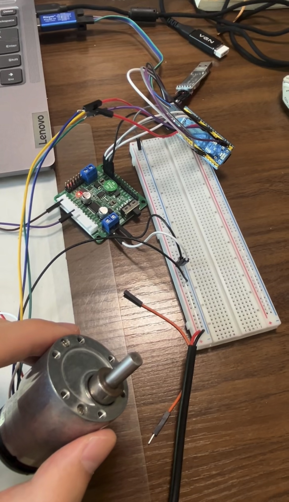

STM32 Cascaded PID Servo Control System

From PID Control to Embodied Intelligence: Building the Execution Foundation of a Robot

Overview

This project presents a complete embedded DC motor servo control system developed from hardware design to closed-loop control implementation.

The system is built on an STM32F103C8T6 microcontroller and implements a cascaded PID control architecture, including:

- Encoder-based feedback acquisition
- PWM motor driving
- Velocity closed-loop control
- Position closed-loop control
- Real-time system debugging and performance evaluation

Unlike projects that rely on pre-built motor control libraries or simulation environments, this project was developed from scratch, including hardware selection, peripheral configuration, control algorithm implementation, parameter tuning, and experimental validation.

The goal of this project is to understand the fundamental execution layer of intelligent robots: how high-level commands can be accurately converted into stable physical movements through feedback control.

1. Motivation: The Execution Layer of Embodied Intelligence

Modern intelligent robots require three essential capabilities:

Perception → Decision → Execution

Recent advances in artificial intelligence have significantly improved robotic perception and decision-making. However, without a reliable execution layer, intelligent decisions cannot be accurately translated into physical actions.

This project focuses on the execution foundation of embodied intelligence.

A robot may understand its environment and generate an optimal action plan, but the final performance depends on whether its actuators can accurately achieve the desired motion under disturbances.

Therefore, I developed a complete servo control system from the lowest hardware layer to the control algorithm layer, aiming to understand how a robot's "muscles" and "nervous system" work together.

The cascaded PID structure implemented in this project is widely used in robotic joints and industrial servo systems, where:

- The position loop determines motion accuracy.
- The velocity loop provides fast dynamic response and disturbance rejection.

2. System Architecture

   
The system uses a multi-rate control strategy:

- Velocity loop update period: 10 ms
- Position loop update period: 100 ms

The inner velocity loop provides fast response, while the outer position loop ensures accurate motion tracking.

3. Hardware Platform

The hardware platform was intentionally designed to provide direct understanding of the complete control pipeline.

Instead of using Arduino libraries or existing motor control frameworks, all peripheral configuration and control logic were implemented independently.

4. Firmware Implementation

The embedded firmware consists of several functional modules:
Firmware Architecture

4.1 Encoder Feedback Acquisition

The motor position and velocity feedback are obtained through quadrature encoder signals.

The STM32 timer encoder mode is configured to directly capture A/B phase signals.

After four-times frequency multiplication:

- Encoder resolution:
  836 pulses/revolution

A timer interrupt is triggered every 10 ms to:

1. Read encoder pulse increment.
2. Calculate rotational speed.
3. Convert pulse information into physical velocity feedback.

This process builds the complete sensing chain from electrical signals to physical motion estimation.

5. PID Controller Implementation

The PID controller was implemented manually in C without using external PID libraries.

The controller includes:

- Proportional regulation
- Integral compensation
- Derivative prediction
- Integral anti-windup
- Output limitation

5.1 Velocity Control

The velocity controller regulates motor speed by minimizing the error between target velocity and measured velocity.

Parameter tuning was performed using real-time waveform visualization through VOFA+.

Final parameters:
Kp = 4.5
Ki = 0.45
Kd = 0.15

5.2 Position Control

A position controller was added outside the velocity loop to form a cascaded servo structure.

The position loop generates the desired velocity command, while the velocity loop controls motor torque output.

To eliminate mechanical oscillation near the target position, a dead-zone strategy was introduced:
Position error < ±8 encoder pulses

→ Stop adjustment
→ Clear integral accumulation

6. Experimental Results

Several experiments were designed to evaluate system performance.

6.1 Velocity Tracking Performance

Target speed:
160 RPM

Measured steady-state speed:
157.89 RPM

Performance:

- Steady-state error: 1.3%
- Settling time: < 2 seconds

6.2 Disturbance Rejection Experiment 
To evaluate feedback control capability, open-loop and closed-loop systems were compared.

Open-loop Control

Fixed PWM duty cycle:
65%

Result:

- Speed dropped from approximately 106 RPM to 60-80 RPM under external load.
- The system could not recover automatically.

Closed-loop PID Control

Target speed:
160 RPM

Result:

- Speed temporarily decreased under disturbance.
- PID controller automatically increased PWM output.
- Speed recovered to approximately 157.89 RPM within 1 second.

This experiment demonstrates the importance of feedback control in maintaining stable robotic motion under uncertain environments.

6.3 Position Control Accuracy
The final position control performance:

- Position accuracy:
  ±6 encoder pulses

- Mechanical angle error:
  <1 degree

The motor can automatically return to the target position after external displacement.

7. Engineering Challenges and Solutions

7.1 Encoder Signal Interference

Problem

The measured speed occasionally increased to unrealistic values (>14000 RPM) due to electrical noise.

Solution

Implemented:

- Internal pull-up resistors
- Software filtering for abnormal pulse values

The combination of hardware and software methods significantly improved signal reliability.

7.2 Motor Driver Failure

Problem

The first TB6612 module was damaged when using a 12V supply due to insufficient voltage tolerance.

Solution

The datasheet was reviewed and the driver module was replaced with a higher-voltage version.

This experience improved my understanding of hardware selection and electrical specifications.

7.3 Embedded Debugging

Problem

Floating-point printing was unavailable in STM32 standard libraries.

Solution

Implemented integer-based decimal output formatting instead of relying on floating-point printf.

8. Project Demonstration

The project demonstrates a complete engineering workflow:
Hardware Design
↓
Peripheral Configuration
↓
Encoder Signal Processing
↓
PID Algorithm Implementation
↓
Parameter Optimization
↓
Experimental Validation

The final system achieves stable speed and position control on a low-cost embedded platform.

9. Connection to Future Robotics Research

This project represents the low-level actuation foundation of future intelligent robotic systems.

The experience gained from this servo platform provides fundamental knowledge for:

- Robot joint control
- Mobile robot motion control
- Manipulator systems
- Autonomous robotic platforms

Future work will focus on integrating this low-level control foundation with higher-level intelligence, including:

- ROS2 robotic systems
- Computer vision-based control
- Autonomous decision-making
- Adaptive control methods

Ultimately, the goal is to bridge the gap between artificial intelligence algorithms and real-world robotic execution.

10. Skills Demonstrated

Embedded System
- STM32
- Timer configuration
- PWM generation
- UART communication

Control Theory
- PID control
- Cascaded control architecture
- Feedback regulation
- Disturbance rejection

Robotics Foundation
- Servo control
- Encoder sensing
- Motion execution

Engineering Practice
- Hardware debugging
- System integration
- Experimental validation
